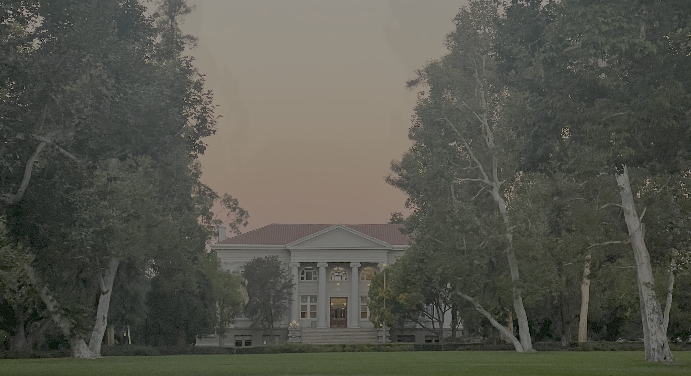
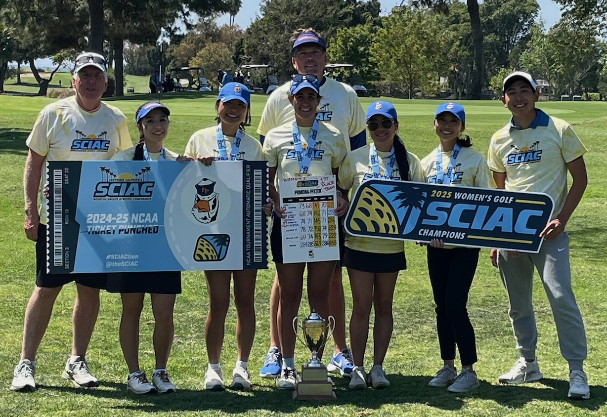

<!--
  IMAGE PLACEHOLDERS BELOW:
  Drop your image files into an `images/` folder next to this .qmd file,
  then update the file paths in the placeholders marked with 📷 comments.
  Recommended: landscape/wide photos for the banner, roughly square for the gallery.
-->

<!-- 📷 BANNER: a wide Claremont / campus shot works well here -->

## Hi There! 👋

My name is **Federica**, and I'm a recent graduate of **Pomona College**, where I double-majored in **Mathematics & Computer Science**. Originally from **Madrid, Spain 🇪🇸**, I moved to the U.S. to pursue new opportunities and spent the last four years living in **Claremont, California**.

Over my time at Pomona, I came to love using data to turn messy problems into clear decisions. My interests sit at the intersection of **statistical modeling, optimisation, machine learning, and data visualisation** — I enjoy everything from building predictive models to crafting visual stories that make results accessible to everyone.

I'm now at **Wake Forest University**, pursuing my **M.S. in Statistics** on a Teaching Assistantship. 

<!-- 📷 GRAD PHOTOS: a small gallery works well for 2-4 photos -->
::: {layout-ncol=2}
{fig-alt="Claremont campus" width="100%"}

{fig-alt="My Graduation Day" width="80%"}

:::

### Lengthy Projects
I have spent the past two summers in [Pomona College](https://www.pomona.edu/) doing some really exciting work alongside some of my favourite Professors, and have continued extending some of that work since graduating:

 **2026, Extending On Par Golf: From Proof-of-Concept to Publication**\
For the past few months, I have been building on the golf strategy project below (*On Par*, Summer '25) — a data-driven framework using Gaussian Process Regression to recommend optimal club and aimpoint choices for a golfer based on their own shot tendencies and the course's layout. Working primarily with [Dr. Jo Hardin](https://hardin47.netlify.app/), we've been extending the project with the goal of completing a full manuscript for peer-reviewed publication. This phase has pushed well beyond the original proof-of-concept and has delved further into formalising a multi-fidelity Gaussian Process fusion that combines simulated and real-outcome data for game play simulation. We have run a full convergence analysis to determine how many Monte Carlo samples are needed before a strategy recommendation can be trusted, and have expanded our set of strategy recommendations by providing the user all club-aimpoint combinations that result in statistically indistinguishable outcomes. We have run a broader sensitivity analysis to investigate how changes in player's shot patterns may independently affect optimal strategy and outcomes, speaking to the long-standing "drive for show, putt for dough" debate in golf analytics. The paper isn't posted here yet — I'll share it once it's finished and submitted (we're targeting the [*Journal of Statistics and Data Science in Sports (JSDSS)*](https://jsds-sports.github.io/), a fully open-access journal), but wanted to flag that this is very much active, ongoing work.

 **2026, Senior Thesis: The Math of Moral Compromise, Beyond Arrow's Impossibility**\
For my senior thesis in Mathematics, advised by [Dr. Vin de Silva](https://www.pomona.edu/directory/people/vin-de-silva), I explored the mathematics of collective decision-making — why no voting system can ever be perfectly fair. After tracing the history of voting theory from Ancient Greece through the French Revolution to the 20th century, I presented a full combinatorial proof of Arrow's Impossibility Theorem before introducing a topological approach using ultrafilters, which offers a structurally cleaner explanation for why dictatorship is mathematically unavoidable on any finite electorate. From a topological perspective we can look at what changes (and what doesn't) under infinite electorates. The thesis closes with a discussion of what all this means for democracy in practice and ways to work around the limitations of this mathematical conundrum. The work was completed with Distinction. Find out more about this work [here](academicprojects/SENIORTHESIS/mySeniorThesis.qmd). 

:::{.column-body}
{fig-alt="Presenting my Senior Thesis"}
:::

  **Summer '25, Simulating Golf Strategy using Gaussian Process Regression**\
During this project we developed a novel data-driven framework to help golfers make better strategic decisions on the course. We modeled golf as a sequential decision-making problem under uncertainty, creating a tool that offers personalized, data-backed recommendations. Using 2D Gaussian Process Regression (GPR), we built a model that assesses the scoring impact of different club and aimpoint combinations. The framework can be tailored to an individual golfer's tendencies (recorded on Trackman data) and needs, alongside the specific golf course layout, and can be adjusted to either minimise expected strokes (the best score on average) or maximise birdie odds (for high-stakes situations). The work establishes a scalable foundation for a future decision-support tool that provides dynamic, adaptive strategy in real-time based on shot outcomes. I produced this initial work alongside [Professor Gabriel Chandler](https://www.pomona.edu/directory/people/gabriel-chandler). This project was selected as the **national winner (1st Prize) at USRESP** and I was given the honour of presenting at **eCOTS 2026**. Find out more about this work [here](academicprojects/GPR4GOLF/gpr4golf.qmd).

 **Summer '24, Evaluating the Reliability of Sicegar for Timing Analysis of RpoS-Dependent Gene Expression**\
We used a simulation-based approach to evaluate the [`sicegar`](https://cran.r-project.org/web/packages/sicegar/index.html)  R package, a tool used by biologists to analyse gene expression data. The project focused on assessing whether the package could reliably detect sigmoidal and double-sigmoidal curves and accurately estimate their onset times - the points where gene expression significantly increases and therefore is activated. By generating synthetic data with known parameters and then introducing noise, we tested the software's performance under various conditions. The results showed that sicegar tends to underestimate the true onset time as data dispersion increases. We then developed a parametric bootstrapping method to correct this bias, demonstrating that this fix can produce estimates that are closer to the real values. I produced this work alongside [Professor Jo Hardin](https://hardin47.netlify.app/). Find out more about this work [here](academicprojects/TIMECOURSE/timeCourse.qmd).

### Other Work

Every once in a while I participate in [tidytuesday](https://github.com/rfordatascience/tidytuesday), which is a weekly social data project with the opportunity to wrangle analyse and visualise new datasets everyweek. As of the creation of this website, I will start to upload some of my work and process  [here](smallprojs/index.qmd).

### A little about me
When I'm not working on a problem set or a paper, I'm usually outside — golfing, doing something creative, or, lately, learning pickleball. I like trying new sports and staying active. <!-- 📷 feel free to swap in / add specifics: photography? painting? cooking? hiking spots around Claremont? -->

I just finished my collegiate carreer as part of **Pomona-Pitzer**'s Varsity Women's Golf team — I served as **2-year Team Captain**, made **3 NCAA National appearances**, won countless team titles which at one point in time ranked us *1st in the country* , and won **2 individual national titles**!

I just started a new section on this website dedicated to reflections on my time as a golfer, and dedicated to my very many interests, you can learn more about my interests outside of the classroom [here](randomReflections/index.qmd).

<!-- 📷 A candid golf/team photo or a favourite Claremont spot could go nicely here -->
::: {layout-ncol=2}
{fig-alt="Photo on the Golf Course Lining up a Putt"}

{fig-alt="A Photo with Some of My Phenomenal Teammates"}
:::

### Tech & tools
Tools I feel comfortable with include `R`, `Python`, `Java`, `JavaScript`, and `HTML` / `SCSS`. I use tidyverse-style workflows for data wrangling and visualisation, and I've worked with HPC for large simulations, as well as GPyTorch for Gaussian Process modeling.

---
At this moment in time, I'm starting my **M.S. in Statistics at Wake Forest University**, while continuing to seek **data science / analytics opportunities** that combine problem-solving, creativity, and impact. If that sounds like a fit, let's connect! ✨
