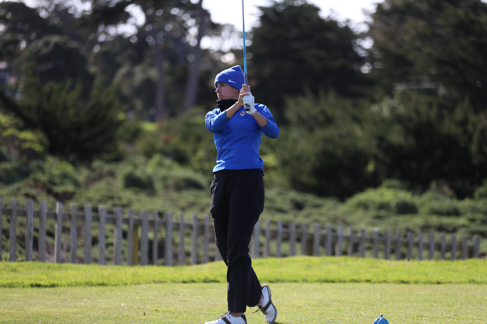

::: {style="text-align: center;"}
{fig-alt="Player's Finish" width="60%"}
:::

<a href="GolfGPRDocuments/USRESP_Contest_FinalFD.pdf" class="btn btn-primary" target="_blank">
   Full Paper
</a>
&nbsp;&nbsp;
<a href="GolfGPRDocuments/GPRPoster.pdf" class="btn btn-primary" target="_blank">
   Research Poster
</a>

## A Brief Intro

During the summer of 2025, we developed a simulation-based framework to model optimal golf strategy through a statistical lens, recognising golf as a sequential decision-making problem under uncertainty. Our work combines player-specific shot data, course geometry, and Gaussian Process Regression (GPR) to estimate the expected strokes to hole out (ESHO) and birdie probability surfaces across a golf hole.

By digitising course layouts and overlaying shot dispersion data from LPGA TrackMan records, we constructed spatially continuous GPR models that capture how club and aimpoint choices influence scoring outcomes. The model recursively works from the green backward - first fitting a 2D GPR to expected strokes on the putting surface, then extending the framework to evaluate approaches and tee shots, using simulated distributions to identify the optimal strategy for any point on the hole.

To accommodate different strategic objectives, we explored multiple loss functions: one minimizing expected strokes (for consistent performance) and another maximizing birdie odds (for high-stakes play). Together, these layers form a dynamic, player-adaptive decision system capable of evolving as new data are recorded.

This project demonstrates the potential of probabilistic modeling and spatial inference in sports analytics, offering a scalable foundation for real-time decision support in golf strategy - a step toward intelligent, data-driven gameplay.

:::{.callout-tip title="National Winner, USRESP"}
This project was named the **national winner (1st Prize) at USRESP** and accepted for presentation at **eCOTS 2026**. 
:::

## Future Directions

This project did not end here! For more information check out [this page](gpr4golf2.qmd).

