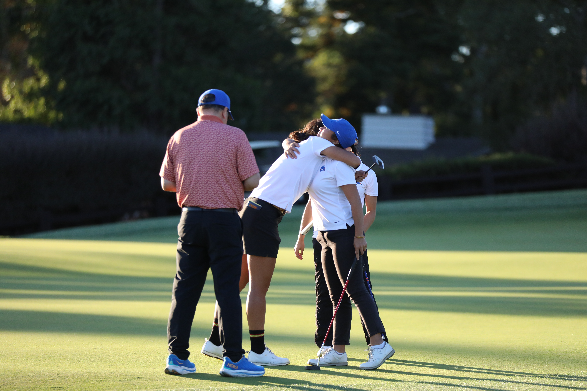

::: {style="text-align: center;"}
{fig-alt="Pasatiempo GC" width="60%"}
:::

This page tracks the next chapter of my *Golf On Par Paper*, the Gaussian Process Regression framework for golf strategy I built in Summer '25. Since December 2025, I've been extending it into a full manuscript for peer-reviewed publication with [Professor Jo Hardin](https://hardin47.netlify.app/) — formalising the multi-fidelity model that fuses simulated and real-outcome data, running convergence and sensitivity analyses, and pushing the framework closer to something that could genuinely inform how a player approaches a hole.

**This work is still in progress.** The manuscript isn't finished or submitted yet, so there's no paper to share here just yet. In the meantime, you can read about where the project started on the [Summer '25 project page](academicprojects/GPR4GOLF/gpr4golf.qmd). Or check out the slides for my [**eCOTS 2026** presentation](https://www.causeweb.org/cause/ecots/ecots26).

:::{.callout-tip title="National Winner, USRESP"}
The original Summer '25 project was named the **national winner (1st Prize) at USRESP** and accepted for presentation at **eCOTS 2026**. 
:::

<a href="Final_Thesis_Presentation.pdf" class="btn btn-primary" target="_blank">
   eCOTS 2026 Slides
</a>

