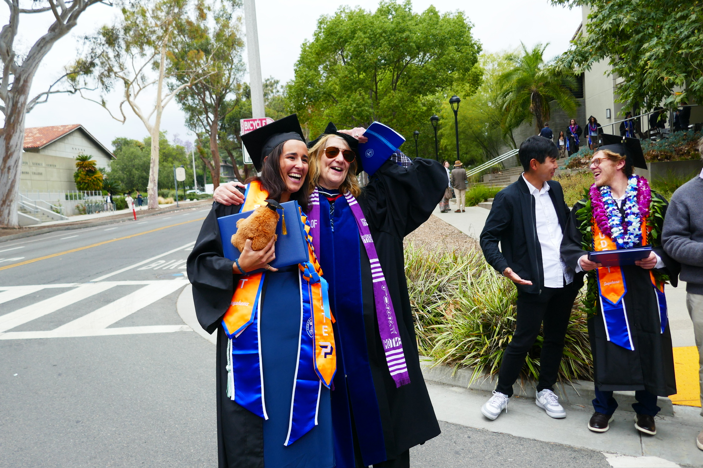

::: {style="text-align: center;"}
{fig-alt="Dr Ami Radunskaya" width="60%"}
:::

Can a group of people ever aggregate their preferences into a single, fair decision? This page holds my senior thesis in Mathematics, *The Math of Moral Compromise: Beyond Arrow's Impossibility*, which traces the history of voting theory, proves Arrow's Impossibility Theorem in full, and reframes it through a topological lens using ultrafilters.

<a href="Thesis_Paper.pdf" class="btn btn-primary" target="_blank">
   Thesis Paper
</a>
&nbsp;&nbsp;
<a href="Final_Thesis_Presentation.pdf" class="btn btn-primary" target="_blank">
   Presentation Slides
</a>
<a href="https://youtu.be/GDxtLtkCYzc" class="btn btn-primary" target="_blank">
   Thesis Talk
</a>

Feel free to read the full paper at your own pace, skim the poster for the highlights, or watch the talk if you'd rather listen than read — no math background required to follow along.